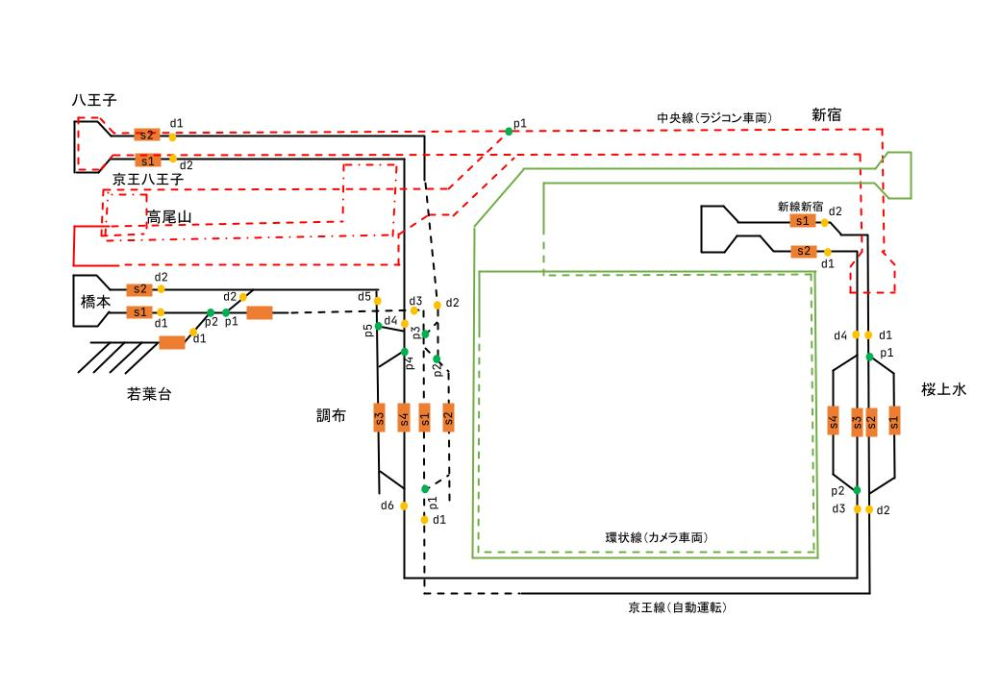

# 2022 年調布祭プラレール企画配線図

## 配線図

[配線図 PDF](./chofufes2022-map.pdf)



駅付近にある`s`, `p` はそれぞれ制御するストップレール、分岐レールを表します。
設定ファイルなどで指定するときは以下のルールで指定します。

```text
<station_name>_<s or b><number>
```

例えば調布駅にあるストップレール `s1`を指定するときは `chofu_s1`と指定します。


名称一覧
```
新宿駅
shinjyuku_p1
shinjyuku_p1
shinjyuku_s1
shinjyuku_s2
桜上水駅
sakurajyosui_p1
sakurajyosui_p2
sakurajyosui_s1
sakurajyosui_s2
sakurajyosui_s3
sakurajyosui_s4
調布駅
chofu_p1
chofu_p2
chofu_p3
chofu_p4
chofu_p5
chofu_s1
chofu_s2
chofu_s3
chofu_s4
橋本
hashimoto_s1
hashimoto_s2
京王八王子
hachioji_s1
hachioji_s2
若葉台(車両基地)
wakabadai_p1
wakabadai_p2
```

サーボモータが ON, OFF になったときの挙動は [./api.md](https://github.com/ueckoken/plarail2021-soft/blob/main/docs/api.md#client---control-external)を参考にしてください。
